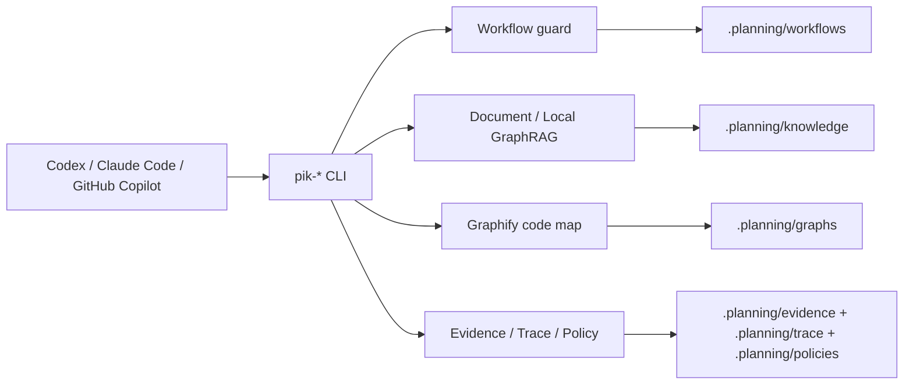
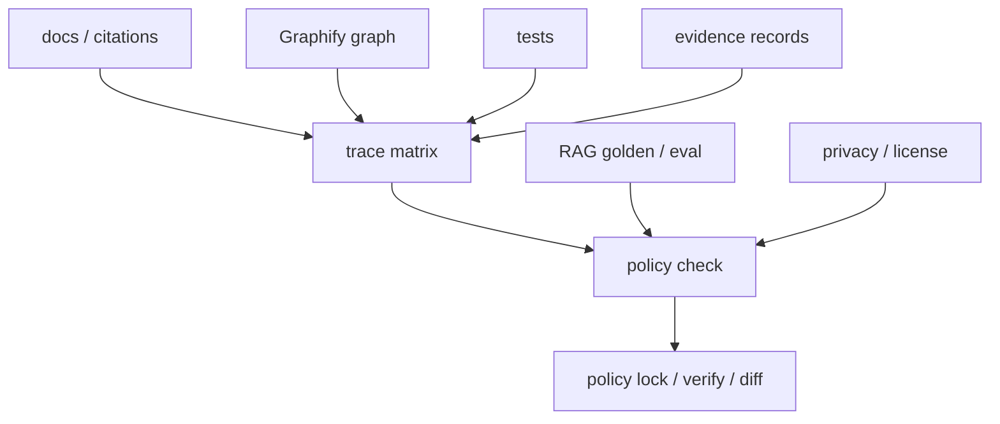
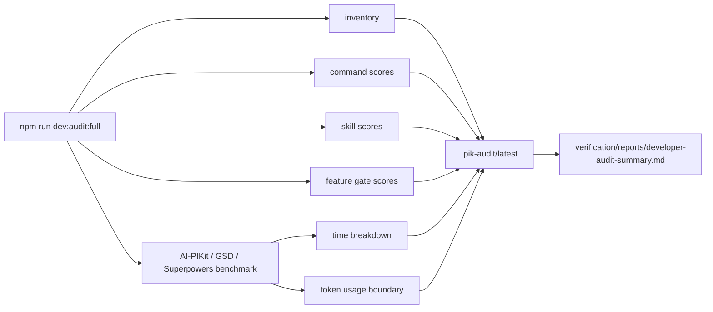

# AI-PIKit 架构说明

AI Project Intelligence Kit，文档缩写 **AI-PIKit**，把 AI coding runtime 和目标项目的工程上下文分开。Codex、Claude Code、GitHub Copilot 负责执行；AI-PIKit 负责把项目状态、仕様依据、代码影响面、验证证据和完成前 gate 组织成可检查的本地制品。



## 1. Workflow Kernel

AI-PIKit 自己拥有 workflow kernel。GSD 只作为参考设计，不再作为用户命令面。

当前公开入口全部是 `pik-*`：

- `pik-debug`
- `pik-plan-phase`
- `pik-execute-phase`
- `pik-code-review`
- `pik-verify-work`
- `pik-complete-milestone`
- `pik-workflow-run`
- `pik-completion-check`

Workflow guard 会检查：

- context
- codebase
- docs
- graph
- plan
- implementation
- verification
- evidence
- writeback

任一 gate 不通过，`pik-completion-check` 就不能通过。

## 2. Document / Local GraphRAG Layer

文档层用于对日文档密集型项目：

- 仕様書
- QA
- 議事録
- 画面設計書
- API / DB / 测试规格
- 运行手顺和交付说明

默认知识后端是 **Local GraphRAG Default Mode**：

- `graphrag-workspace/settings.yaml`
- Ollama 本地 LLM
- Ollama 本地 embedding
- LanceDB
- `http://127.0.0.1:11434`
- 不需要 `GRAPHRAG_API_KEY`

关键命令：

```bash
pik-docs-scan --target "$PWD"
pik-docs-extract --target "$PWD"
pik-rag-init-local --target "$PWD"
pik-docs-index --target "$PWD" --run
pik-docs-query --target "$PWD" --rag "仕様根拠は？"
```

文档更新后应重跑：

```bash
pik-docs-sync --target "$PWD"
pik-docs-query --target "$PWD" "仕様根拠は？"
pik-answer-audit --target "$PWD"
```

默认 `pik-docs-sync` 只做 scan / diff / extract / citation audit，并写 `STALE_NEEDS_REFRESH`；需要重建本地 GraphRAG index 时才显式运行 `pik-docs-sync --target "$PWD" --index`。

## 3. Graphify Code Map Layer

Graphify 是代码地图后端。AI-PIKit 不重写 Graphify，而是负责：

- 执行配置中的 Graphify command。
- 同步 `graphify-out/graph.json` 到 `.planning/graphs/graph.json`。
- 同步 `graphify-out/GRAPH_REPORT.md` 到 `.planning/graphs/GRAPH_REPORT.md`。
- 在 workflow guard 中检查 graph 是否存在、是否 stale。

关键命令：

```bash
pik-graph-build --target "$PWD" --run
pik-graph-query --target "$PWD" "PaymentService"
pik-graph-impact --target "$PWD" --files "src/a.js"
pik-graph-risk --target "$PWD"
pik-graph-freshness --target "$PWD" --strict
```

## 4. Evidence Quality & Policy Mode

MVP3 增加了一层证据质量控制。它不只记录 evidence，还检查 evidence 是否可靠。



新增制品：

- `.planning/quality/rag-goldens.json`
- `.planning/quality/RAG_GOLDEN_RESULTS.md`
- `.planning/quality/RAG_EVAL.md`
- `.planning/knowledge/CITATION_AUDIT.md`
- `.planning/trace/TRACE_MATRIX.json`
- `.planning/trace/TRACE_AUDIT.md`
- `.planning/policies/POLICY_CHECK.md`
- `.planning/policies/POLICY_LOCK.md`
- `.planning/policies/POLICY_VERIFY.md`
- `.planning/policies/POLICY_DIFF.md`
- `.planning/help/HELP_SKILLS.md`

关键命令：

```bash
pik-rag-golden-run --target "$PWD"
pik-citation-audit --target "$PWD"
pik-trace-build --target "$PWD"
pik-trace-audit --target "$PWD"
pik-policy-check --target "$PWD" --strict
pik-policy-lock --target "$PWD"
pik-policy-verify --target "$PWD"
pik-policy-diff --target "$PWD"
pik-help-skills --target "$PWD" "我现在是文档更新情况，有没有适合我的命令"
```

MVP6 开始，workflow / policy gate 使用四态语义：`PASS`、`FAIL`、`WAIVED_WITH_RISK`、`STALE_NEEDS_REFRESH`。`graph-lite` 可以带风险跳过文档，`default-local-rag` 对 stale 只提醒，`full-strict` 对 stale、missing citation 和外部 provider 硬阻断。policy lock/verify/diff 只做轻量检查，不触发 GraphRAG index 或 Graphify build。

## 5. Runtime Adapter Layer

Codex、Claude Code、GitHub Copilot 的适配方式不同，但功能不分叉：

| Runtime | 文件形式 | 用户调用 |
| --- | --- | --- |
| Codex | `SKILL.md` | `$pik-debug` |
| Claude Code | `SKILL.md` | `/pik-debug` |
| GitHub Copilot | `*.prompt.md` | `/pik-debug` |

Runtime pack 只负责把用户带到同一套本地 CLI：

```bash
pik-runtime-install --runtime codex --dest ~/.codex/skills
pik-runtime-install --runtime claude-code --dest ~/.claude/skills
pik-runtime-install --runtime github-copilot --dest .github/prompts
```

可信边界仍然是本地 `pik-*` 命令和 `.planning/` artifact。

## 6. Developer Audit Layer

Developer Audit 是维护者专用质量控制面，不属于普通项目运行时，也不写入目标项目 `.planning/`。它读取仓库命令、runtime pack、verification reports 和 synthetic benchmark fixture，生成 `.pik-audit/latest/` 下的 scorecard。



最近一次完整审计结果为 `96 / A`：71 个命令、33 个 runtime skill/prompt、feature gates 均完成评分。最新三方 benchmark 为 AI-PIKit `90 / A`、GSD `88 / B`、Superpowers `82 / B`；scorecard 中的 `Benchmark comparison: 87` 是全部对标行的混合平均，不是 AI-PIKit 单体分。AI-PIKit `graph-lite` 证明低成本 “AI-PIKit + Graphify” 模式可用；full-local 在无文档场景输出 `EXPECTED_BLOCK`，作为正确安全边界记录。GSD / Superpowers 使用本机真实 skill/plugin 文件做 `skill-pack-backed-replay`，不假装拥有 AI-PIKit repository-local CLI 和 local GraphRAG default mode。

## 7. Local-only 安全边界

AI-PIKit 默认不主动上传项目数据。风险主要来自你把配置改成外部 provider。

被重点审计的配置包括：

- `.planning/config.json`
- `graphrag-workspace/settings.yaml`
- `graphrag-workspace/.env`
- `.planning/knowledge/RAG_INDEX_RESULT.md`
- `.planning/knowledge/RAG_QUERY_RESULT.md`
- `.planning/graphs/GRAPH_BUILD_RESULT.md`

保密项目建议：

```bash
pik-offline-lock --target "$PWD"
pik-privacy-audit --target "$PWD" --strict
pik-outbound-audit --target "$PWD"
pik-policy-check --target "$PWD" --strict
pik-policy-lock --target "$PWD"
pik-policy-verify --target "$PWD"
```

## 8. 验证架构

当前验证分三层：

```bash
npm run verify:mvp3
npm run verify:mvp35
npm run verify:workflow-facade
npm run verify:policy-hardening
npm run verify:cockpit-build
npm run verify:full-command-surface
npm run verify:skills-usability
npm run verify:workflow-closure
npm run verify:docs-completeness
npm run verify:quality-closure
npm run verify:dev-audit-harness
npm run verify:quality
npm run verify:integration
npm run dev:audit:full
```

- `verify:mvp3` 验证 golden、citation、trace、policy、help skills。
- `verify:mvp35` 验证 refresh/preflight/mode、相关/无关 commit 判断和文档同步要求。
- `verify:workflow-facade` 验证 public workflow 自动写 facade、输出下一步建议并保持 no heavy refresh。
- `verify:policy-hardening` 验证 policy lock/verify/diff、四态语义、profile 阻断和 no heavy refresh。
- `verify:cockpit-build` 验证 cockpit 独立模板、假数据样例、稳定 `cockpit-viewmodel.v1` 和 `pik-cockpit-build` 真实项目快照；真实快照能生成本地静态驾驶舱，安全处理 Graphify HTML，并展示 RAG/workflow/quality/privacy/evidence 状态。Graphify impact 预览借鉴 Graphify viewer 的固定图模型，支持搜索、节点详情、legend 过滤和大图 community 聚合。
- `verify:full-command-surface` 执行 `package.json` 中全部 `pik-*` / `pik` 命令。
- `verify:skills-usability` 验证 Codex / Claude Code / GitHub Copilot 33 个 skill/prompt 都能指向本地 CLI 并保留 local-only / no hidden refresh / evidence writeback 约束。
- `verify:workflow-closure` 验证新项目、既有项目、graph-lite、full-strict 四条闭环 fixture。
- `verify:docs-completeness` 验证命令手册 71 个独立锚点、详情字段和 README 跳转。
- `verify:quality-closure` 聚合质量闭环 gate。
- `verify:dev-audit-harness` 验证维护者内部审计机制，`dev:audit:full` 生成命令/skills/feature/benchmark scorecard 和时间/token/隔离报告。
- `verify:quality` 聚合 docs、RAG、本地 GraphRAG、Graph hardening、privacy、license、schema、naming、runtime、visual。
- `verify:integration` 验证完整 AI-PIKit workflow 和 Graphify / RAG 增强链路。

完整测试计划在 [full-test-plan.md](full-test-plan.md)，阶段追踪在 [changelog.md](changelog.md)。
