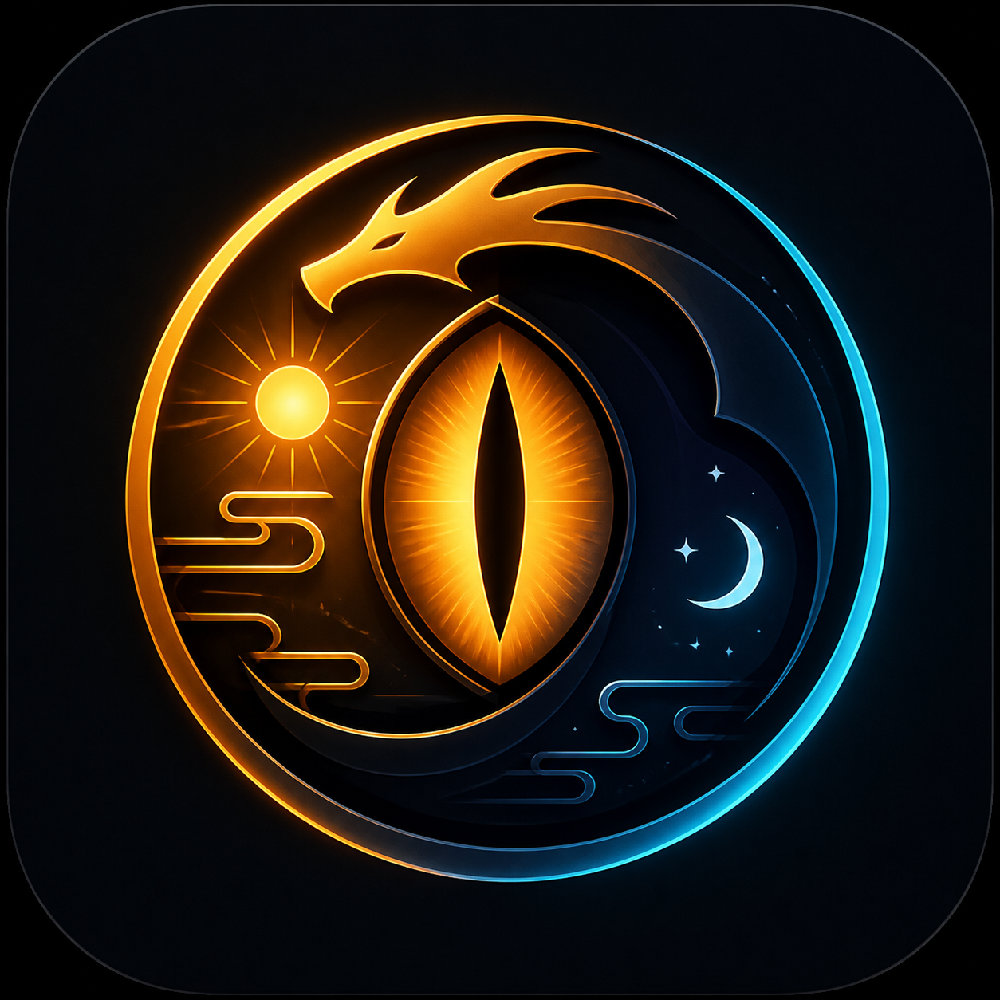
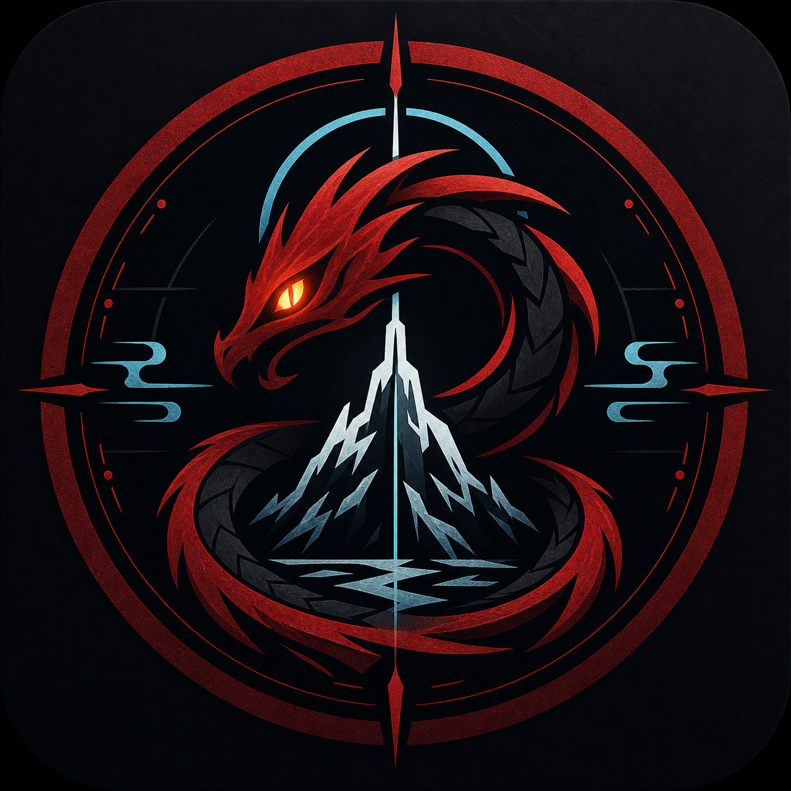
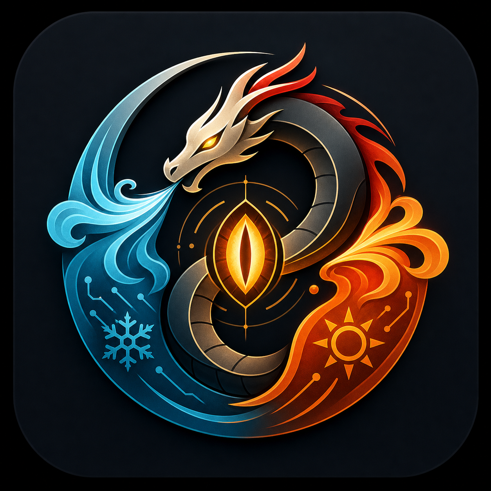
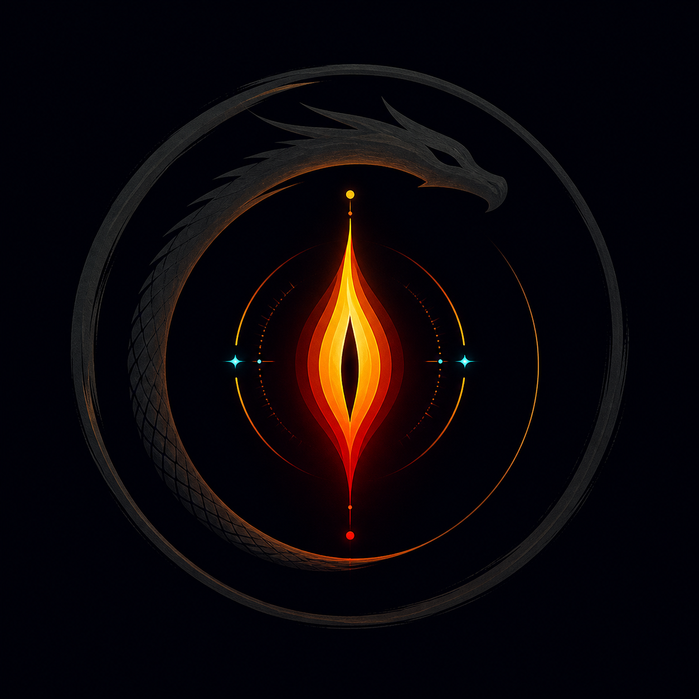
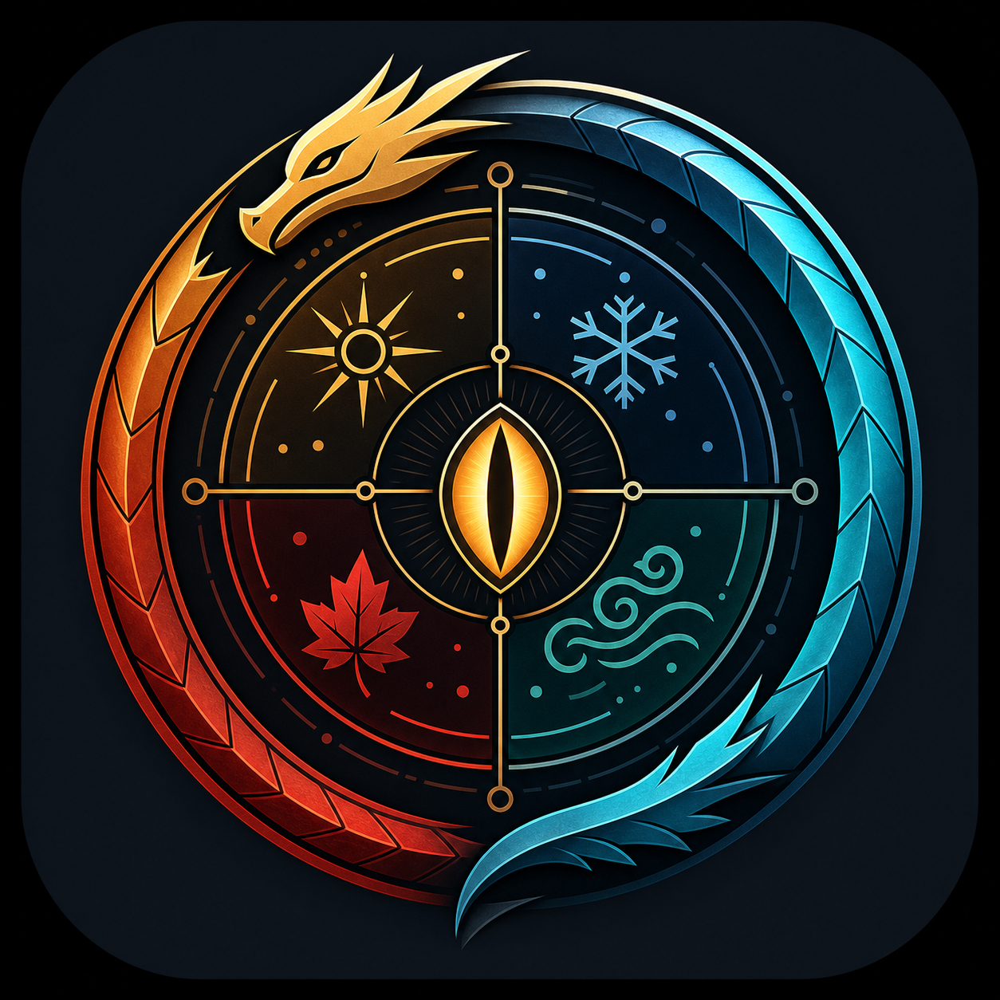
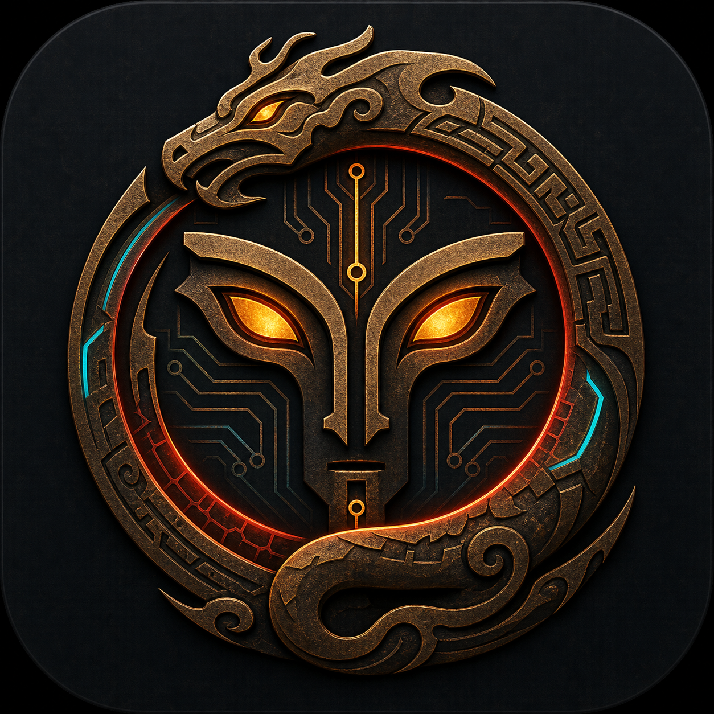
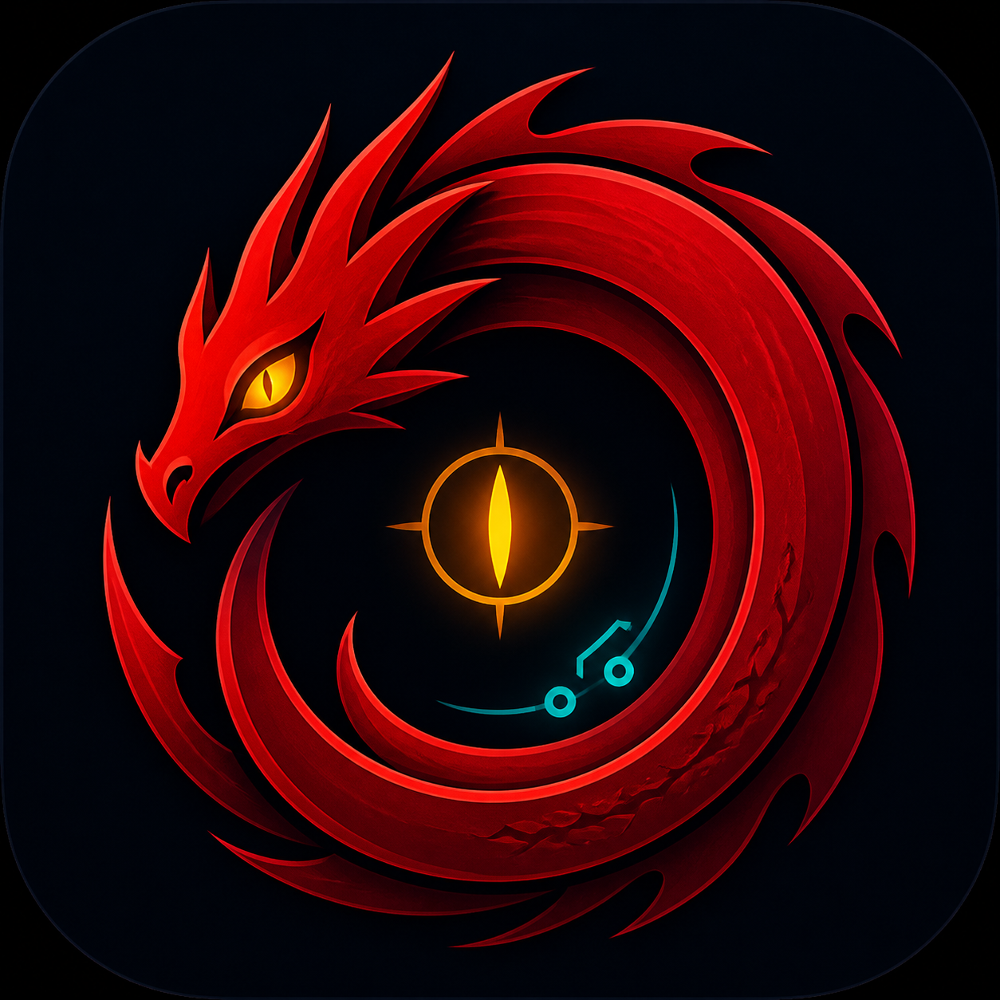
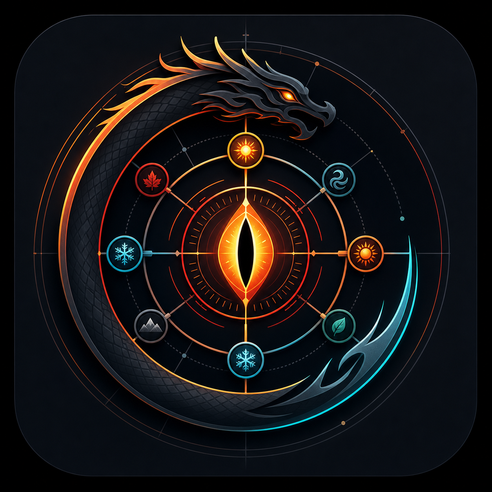
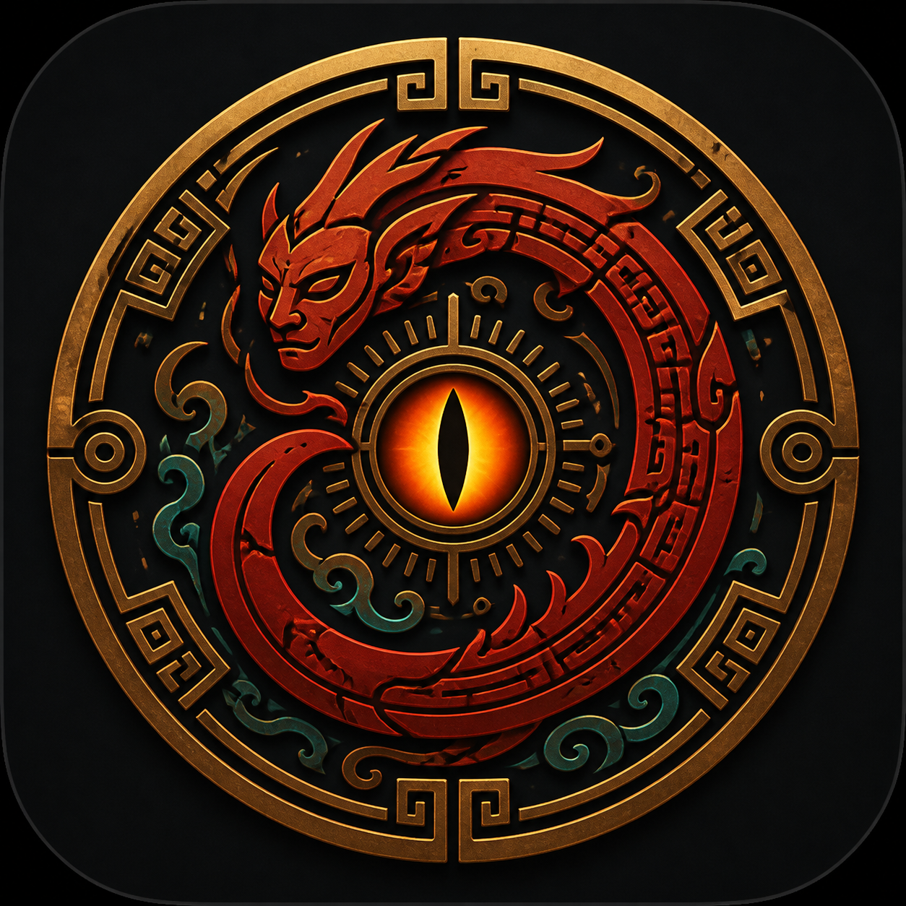
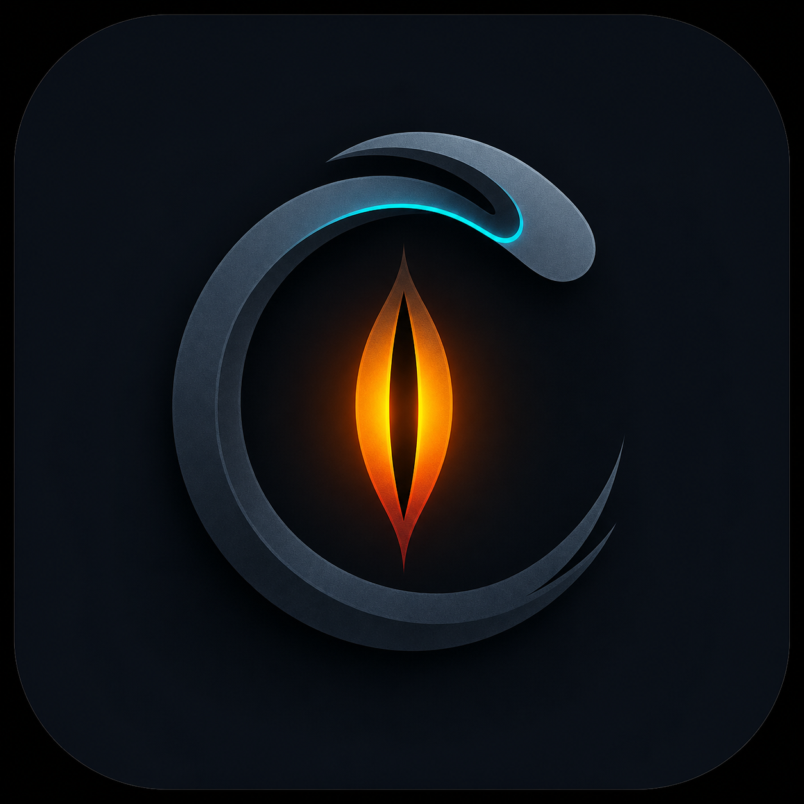

# Zhulong Icon Variants

Ten visual directions for the Zhulong（烛龙）brand mark, redesigned around the mythic concepts of daylight/night, seasons, northern darkness, cosmic order, and ancient dragon divinity.

## 01. Day-Night Eye / 睁眼为昼闭眼为夜

- Core idea: the eye that opens into day and closes into night.
- Best for: main app icon, GitHub avatar, README hero mark.
- Brand feel: direct, memorable, mythic without needing explanation.

## 02. Zhongshan North / 极北钟山

- Core idea: the far-north world-edge god at Zhongshan.
- Best for: darker product pages, social preview, high-pressure brand moments.
- Brand feel: monumental, cold, ancient.

## 03. Breath of Seasons / 吹气为冬呼气为夏

- Core idea: one breath splits winter and summer.
- Best for: product storytelling, quality dashboard, lifecycle visuals.
- Brand feel: dynamic, cyclic, system-level.

## 04. Candle in the Dark / 烛阴照幽

- Core idea: a flame-eye lighting the hidden dark.
- Best for: minimal GitHub icon, favicon candidate, docs header.
- Brand feel: restrained, premium, developer-tool friendly.

## 05. Time Order Ring / 时间秩序环

- Core idea: daylight, darkness, seasons, and time arranged into one ring.
- Best for: architecture docs, workflow diagrams, product page.
- Brand feel: ordered, technical, cosmic.

## 06. Ancient Human-Face Serpent / 人面蛇身抽象

- Core idea: ancient human-face serpent mythology translated into a mask-seal.
- Best for: bold brand direction, mythology-heavy identity, launch visuals.
- Brand feel: strange, archaic, high-pressure.

## 07. Red Primordial Dragon / 赤色原始龙神

- Core idea: red-bodied primordial dragon god, simplified into a spiral.
- Best for: strong GitHub avatar, package icon, social avatar.
- Brand feel: powerful, simple, iconic.

## 08. Cosmic Rule Engine / 天象规则引擎

- Core idea: mythic cosmic order connected to deterministic engineering checks.
- Best for: quality audit feature, cockpit, validation docs.
- Brand feel: technical, precise, AI-engineering native.

## 09. Classic of Mountains and Seas Seal / 山海经神印

- Core idea: an ancient seal inspired by Shanhaijing-style mythic imagery.
- Best for: Chinese myth identity, docs cover, splash art.
- Brand feel: culturally rooted, mysterious, strong.

## 10. Minimal Zhulong Mark / 极简烛龙标

- Core idea: the smallest possible eye/flame plus serpent arc.
- Best for: favicon, CLI docs, package badge, final SVG conversion.
- Brand feel: clean, modern, most maintainable.

## Recommendation

For the main GitHub repository icon, shortlist:

1. **04 Candle in the Dark**: best balance of myth and engineering restraint.
2. **07 Red Primordial Dragon**: strongest avatar impact.
3. **10 Minimal Zhulong Mark**: easiest to simplify into final SVG/favicons.
4. **01 Day-Night Eye**: clearest link to the actual Zhulong myth.

For the product page or social preview, shortlist:

1. **02 Zhongshan North**
2. **03 Breath of Seasons**
3. **05 Time Order Ring**
4. **09 Shanhaijing Seal**
