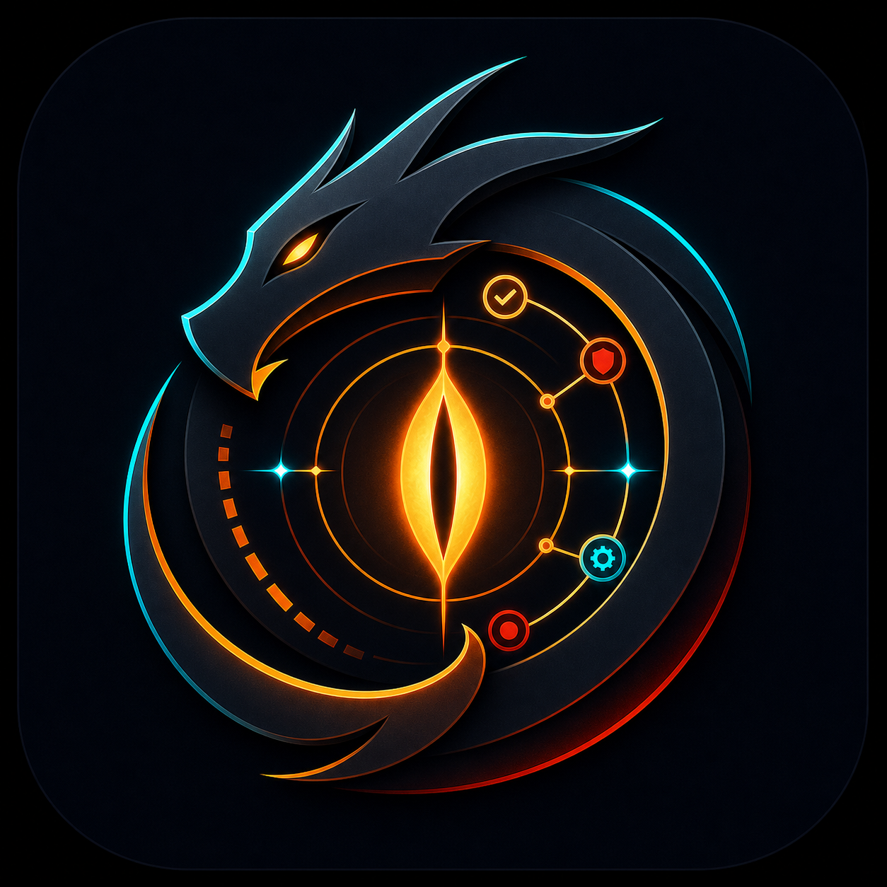
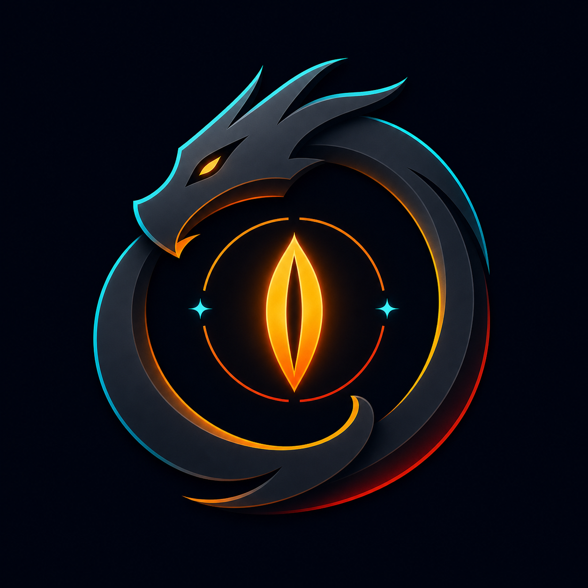
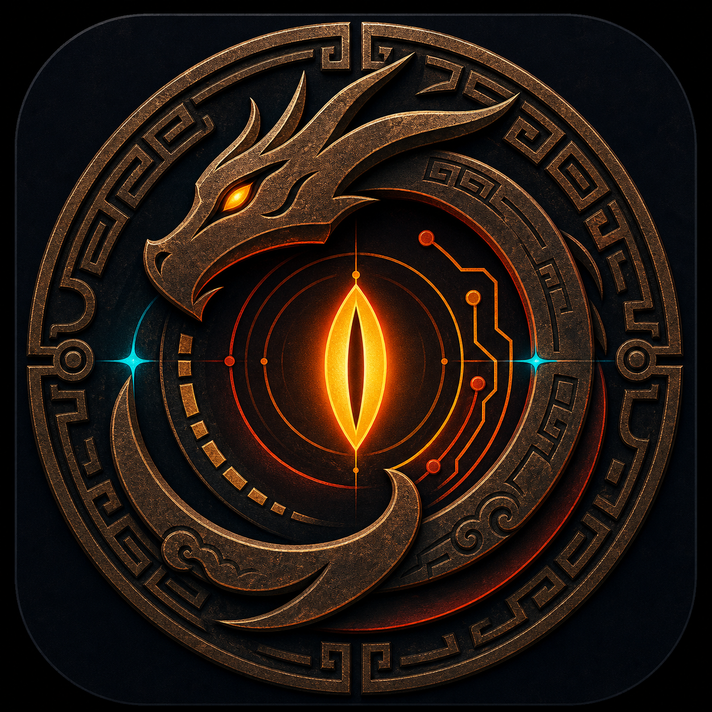
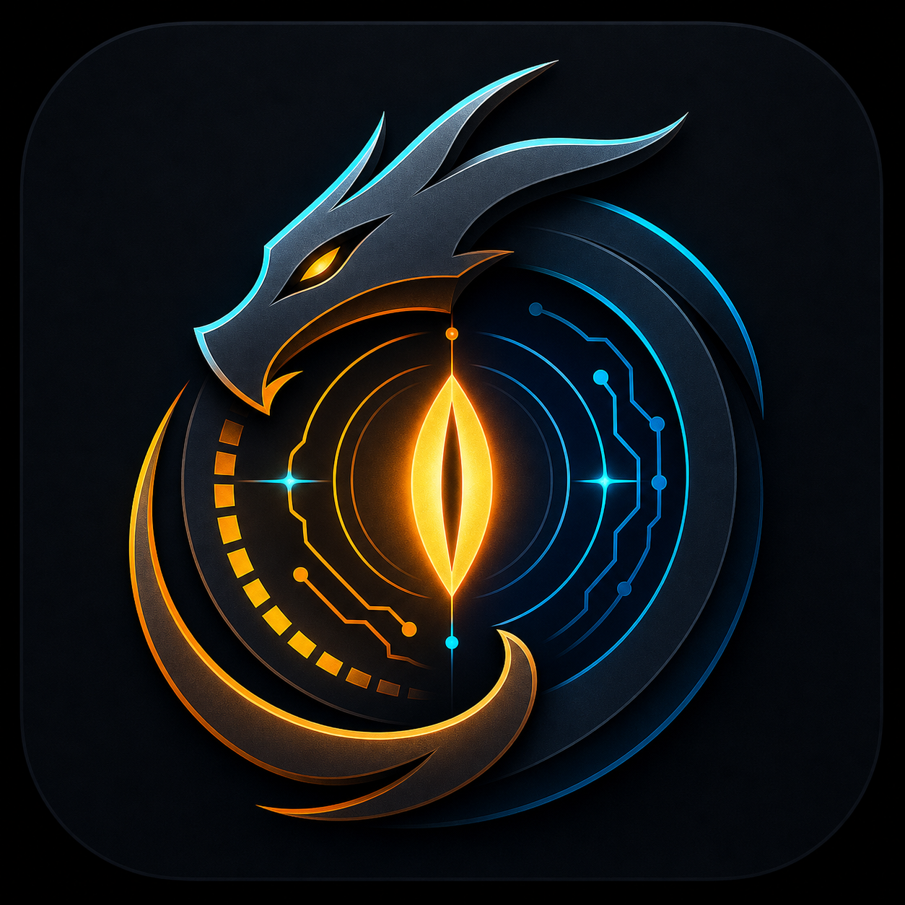
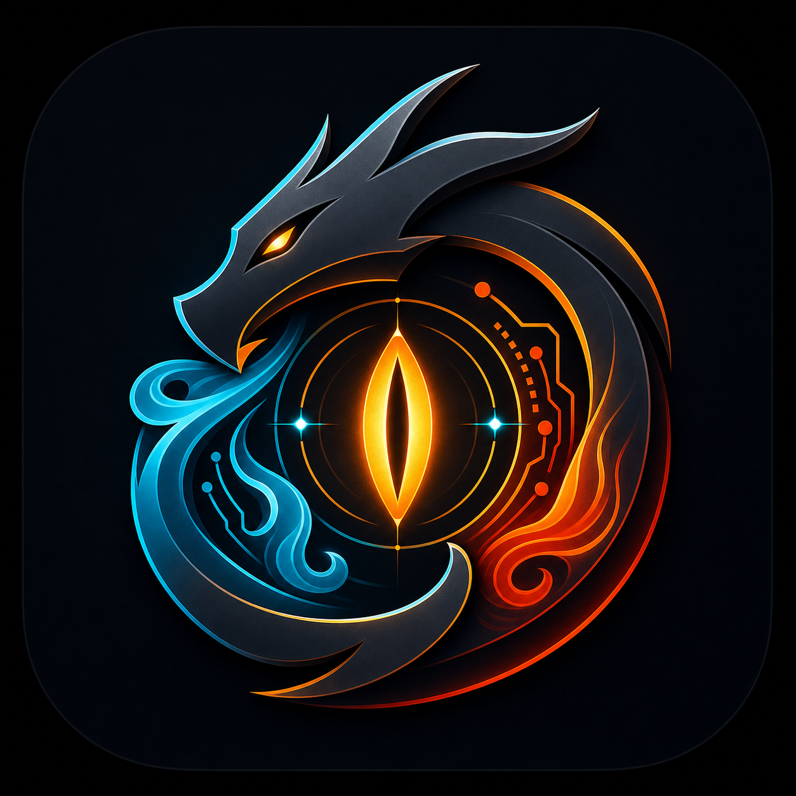

# Zhulong Selected Direction Variants

These five variants are based on the user-selected Zhulong icon direction:
dark field, serpent-dragon ring, central candle-eye / vertical pupil, ember orbital lines, and restrained cyan signal points.

## Final Selection

This is the selected canonical direction. It is copied to:

- `docs/assets/zhulong-icon.png`
- `docs/assets/zhulong-icon-concept.png`
- `docs/assets/zhulong-selected-variants/zhulong-selected-final.png`

## 01. Minimal GitHub Avatar

- Keeps the same silhouette but reduces fine ticks and texture.
- Best for: GitHub avatar, npm/package icon, small README icon.
- Direction: safest final mark if small-size readability is the priority.

## 02. Ancient Seal

- Pushes the mark toward archaic bronze, Shanhaijing seal, and ancient god pressure.
- Best for: product hero, launch visuals, social preview.
- Direction: strongest mythic identity, but heavier for tiny sizes.

## 03. Day-Night Split

- Adds a clearer warm/cold split for “睁眼为昼，闭眼为夜”.
- Best for: main brand icon if the myth needs to be legible without explanation.
- Direction: strong balance of myth and modern product polish.

## 04. Breath of Seasons

- Adds subtle winter/summer currents around the central candle-eye.
- Best for: feature pages, workflow/lifecycle visuals, secondary brand asset.
- Direction: most dynamic, good for storytelling.

## 05. Evidence Orbit

- Adds light node-and-orbit details for evidence chains, workflow gates, and deterministic checks.
- Best for: Zhulong Kit engineering/product positioning.
- Direction: closest to the actual tool concept, but may need simplification before final favicon use.

## Shortlist Advice

- Pick **01** if you want the cleanest repo avatar.
- Pick **03** if you want the best myth-to-brand balance.
- Pick **05** if you want the icon to say “AI engineering kit” immediately.
- Pick **02** if you want the most mythic and high-pressure visual.
